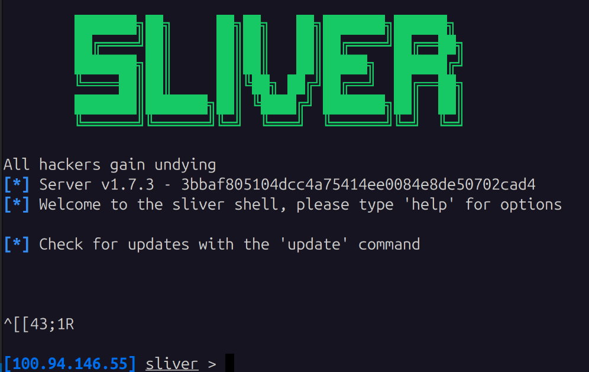

# Operator Setup & CLI Cheat-Sheet

This section covers the configuration required on the analyst's laptop to establish a secure connection to the remote server daemon, followed by a cheat-sheet of essential execution commands.

### 1. Client Installation
The universal client binary is installed locally on the analyst's laptop using the official deployment script:

```bash
curl -s [https://sliver.sh/install](https://sliver.sh/install) | sudo bash
```

### 2. Cryptographic Profile Transfer & Import

Traditional password authentication is not supported by Sliver. All control sessions are authenticated via strict mutual TLS (mTLS).

1. Secure Copy (SCP): Download the operator certificate profile generated by the server over the secure Tailscale VPN connection:

```bash
scp _your_name@_your_ip:/tmp/meinlaptop.cfg ~/Downloads/
```
2. Profile Import: Register the configuration profile within your local client data store: 
```bash
sliver-client import ~/Downloads/meinlaptop.cfg
```

3. Establish Connection: Launch the interactive console. The client will automatically read the imported certificates and open an encrypted control tunnel to the server:

```bash
sliver-client
```
>
