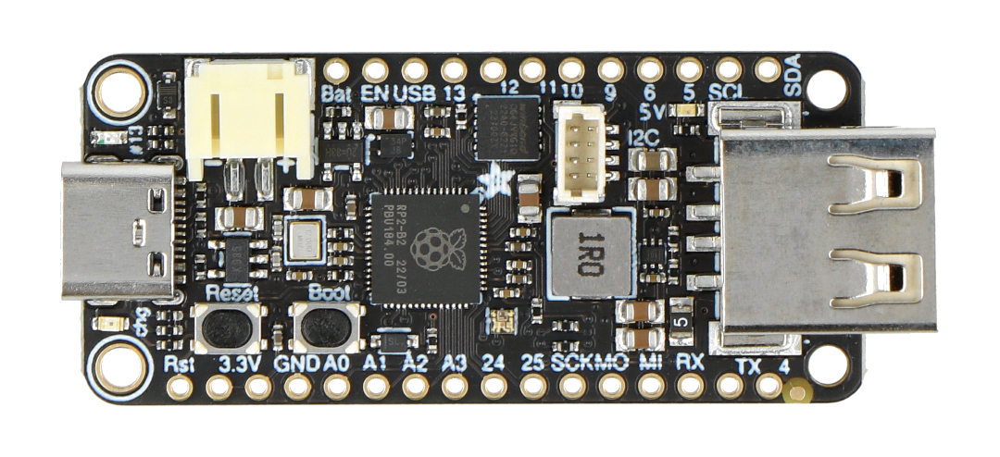

### Required Hardware

- Adafruit RP2040 Feather (with USB host support)  
- USB keyboard (target device to capture input from)  
- USB cable(s) for connecting the RP2040 between keyboard and computer  
- Target computer or system (receives forwarded input)  

Here is a picture:  
