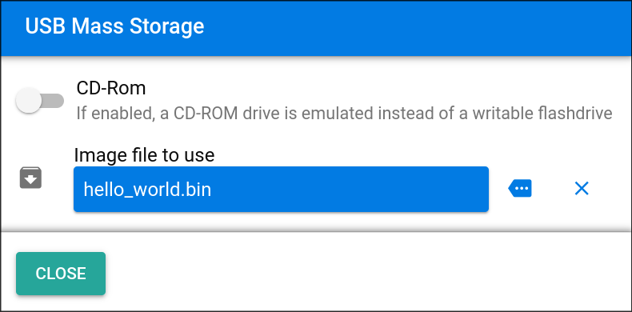

{{#title P4wnP1 - storage emulation}}
# Mass Storage Emulation

The P4wnP1 can emulate a USB flash drive or a read-only CD-ROM, which helps maintain the illusion of it being just an ordinary USB drive.

The feature can be set up in a few steps:

## 1. Create a Disk Image

An image of the filesystem that the target machine should mount is required. Conveniently, P4wnP1 ships with a small bash script that makes creating these images straightforward.

The script is located at:

```
/usr/local/P4wnP1/helper/genimg
```

Start by creating a directory containing the files to be included in the filesystem:

```bash
$ mkdir payload
$ echo "hello world" > payload/readme.txt
```

Then pass that directory to `genimg`:

```bash
$ ./genimg -i <path-to-directory> -o <name> -l <label> -s <size-in-mb>
```

- `<name>` — a unique identifier for the output file (no path)
- `<label>` — the drive name shown when mounted on the target machine

For example:

```bash
$ ./genimg -i ./payload -o hello_world -l "WORKFILES" -s 64
```

The generated image is stored at:

```
/usr/local/P4wnP1/ums/flashdrive/<name>.bin
```


## 2. Enable the Image

Now that the P4wnP1 has our image, we can set it up.

Open the Web UI and switch to the USB tab:


In the bottom right, enable `Mass Storage` and open the settings with the button that appears to its right. Then select your image from the dropdown.

It should look like this:



Now close the popup, deploy the config with the `Deploy` button at the top, and you're done!
