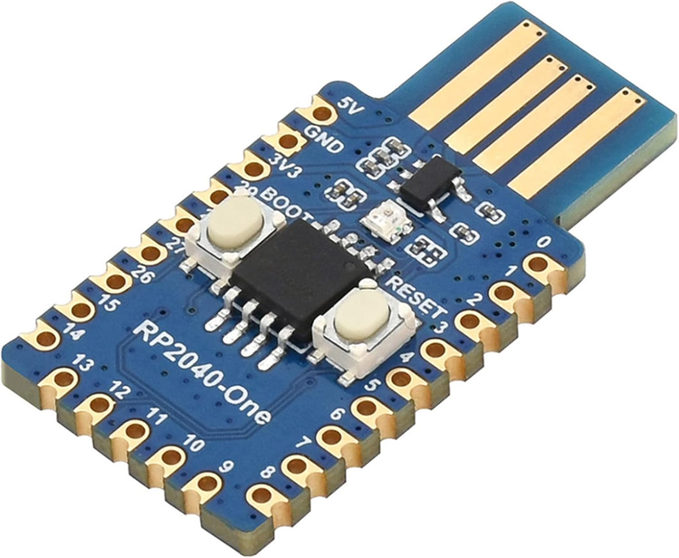

{{#title RubberDucky}}
# The RubberDucky

## Choice of components
We based our design on an `RP2040 microcontroller`, specifically the `waveshare RP2040-One` for the final, USB-Stick lookalike. This chip allows us to run a full CircuitPython Firmware for easy scripting and a lot of flexibility. 

Here is a picture:

